# Buddy

A local, privacy-first voice assistant for Windows. Control your PC with natural language - open files, launch apps, manage volume, and execute system commands.

**Core Principle:** Everything stays on your machine. No cloud. No telemetry. No paid APIs.

## Status

**Current Version:** 0.1.0-alpha (MVP)  
**Target:** Windows 10/11 (native binary)  
**Development:** WSL2 + cross-compilation

## Features

- 🎤 **Voice Commands** - Natural language control via Blue Yeti or similar quality mic
- 🤖 **AI-Powered Intent** - Local DeepSeek interprets what you want
- 🔒 **Privacy First** - All processing happens locally, nothing leaves your machine
- ⚙️ **Config-Driven** - Define your files, apps, and commands in TOML
- 🔊 **Audio Feedback** - Simple confirmation sounds or TTS responses
- ⚡ **Hotkey Activated** - Press key combo, speak command, done (wake word coming in v0.2)

## Quick Start

```bash
# In WSL2 after cloning this repo
cd buddy
rustup target add x86_64-pc-windows-gnu
cargo build --target x86_64-pc-windows-gnu --release

# Run on Windows (copy the .exe somewhere convenient first)
./target/x86_64-pc-windows-gnu/release/buddy.exe
```

Press configured hotkey (default: `Ctrl+Alt+B`), speak your command, wait for confirmation.

## Example Commands

```
"Open details"             → Opens the file mapped to `details`
"Launch chrome"            → Launches the app mapped to `chrome`
"Open my resume"           → Opens resume.docx
"Set volume to 25"         → Calls the `volume_set` system action
"Mute the audio"           → Runs `volume_mute`
"Go to sleep"              → Puts the PC to sleep
"Lock the computer"        → Locks the current session
```

## Architecture


## System Flow

```mermaid
sequenceDiagram
    participant User
    participant Buddy
    participant Mic as Microphone
    participant Whisper
    participant DS as DeepSeek Local
    participant OS as Windows

    User->>Buddy: Press Ctrl+Alt+B
    Buddy->>Mic: Record audio
    Mic->>Whisper: 16k PCM
    Whisper->>Buddy: "open my resume"
    Buddy->>DS: Intent Request + Config
    DS->>Buddy: {"action": "open", "target": "resume"}
    Buddy->>OS: Open resume.docx
    OS->>Buddy: Success
    Buddy->>User: 🔊 "Ok"
```



## Configuration

### config.toml

Buddy looks for a config file path passed as the first argument. If you don’t provide
one it falls back to `config.toml` in the current working directory (keep it next to
`buddy.exe` for the easiest setup). Start from `buddy/config.example.toml`.

```toml
[audio]
# Optional microphone name, defaults to system input
# device_name = "Blue Yeti"
# How long Buddy records audio (seconds)
capture_duration_secs = 3
sample_rate = 16000

[hotkey]
# Trigger combination to start listening
key = "ctrl+alt+b"

[feedback]
# Audio feedback mode: "sound", "tts", or "both"
mode = "tts"
success_sound = "assets/success.wav"  # optional
error_sound = "assets/error.wav"      # optional
tts_voice = "default"                 # Windows SAPI voice

[deepseek]
# Local DeepSeek API endpoint
endpoint = "http://localhost:11434/api/chat"
model = "deepseek-r1:latest"
timeout_secs = 60

[transcription]
# Path to a Whisper model (download via scripts/fetch_whisper_model.sh)
model_path = "models/ggml-base.en.bin"
# Force a language (remove to auto-detect)
language = "en"
# threads = 4

# File mappings - "open X" commands
[files]
details = "C:/Users/YourName/Documents/details.md"
resume = "C:/Users/YourName/Documents/resume.docx"
contacts = "C:/Users/YourName/Documents/contacts.txt"

# Application mappings - "open/launch X" commands
[applications]
chrome = "chrome"
firefox = "firefox"
vscode = "code"
terminal = "wt"  # Windows Terminal

# System actions - available commands
[system]
volume_mute = true
volume_up = true
volume_down = true
volume_set = true  # "set volume to 50"
sleep = true
shutdown = true
restart = true
lock = true
```

## Dependencies

### Core
- **whisper-rs** - Local Whisper inference
- **cpal** - Audio capture from Windows input devices
- **windows** - Win32 APIs for hotkeys/system actions
- **reqwest** - HTTP client for DeepSeek API calls
- **serde / serde_json / toml** - Config and JSON parsing
- **tokio** - Async runtime for the hotkey listener + HTTP

### Audio/Feedback
- **rodio** - Audio playback for confirmation/error sounds
- **tts** (Windows only) - Windows SAPI voices for spoken feedback

## Setup Instructions

### 1. Install Rust and Targets

```bash
# In WSL2
curl --proto '=https' --tlsv1.2 -sSf https://sh.rustup.rs | sh
rustup target add x86_64-pc-windows-gnu

# Install MinGW cross-compiler
sudo apt update
sudo apt install -y mingw-w64
```

### 2. Download a Whisper Model

```powershell
# From repo root
cd buddy

# Download the default base English model (~140MB)
scripts/fetch_whisper_model.ps1 ggml-base.en.bin
```

### 3. Setup DeepSeek Local

```bash
# Install Ollama (or your preferred local LLM runner)
# On Windows: Download from https://ollama.ai

# Pull DeepSeek model
ollama pull deepseek-r1:latest

# Verify it's running
curl http://localhost:11434/api/tags
```

### 4. Create Config

Copy `buddy/config.example.toml` to `config.toml` and edit paths on Windows (Notepad or any editor).

### 5. Build and Run

From PowerShell (with MinGW and Whisper model ready):

```powershell
cd buddy
scripts/build_windows.ps1
& ..\target\x86_64-pc-windows-gnu\release\buddy.exe
```

## Usage

1. **Start Buddy** - Run `buddy.exe` (consider adding to startup)
2. **Press Hotkey** - Default `Ctrl+Alt+B`
3. **Speak Command** - "Open my resume" or "Mute volume"
4. **Wait for Confirmation** - Audio feedback indicates success/failure

## DeepSeek Prompt Strategy

Buddy sends this context to DeepSeek for intent parsing:

```
You are a command interpreter for a voice assistant.

User said: "{transcription}"

Available capabilities:
FILES: {list of file keys from config}
APPS: {list of app keys from config}  
SYSTEM: {list of enabled system actions}

Respond with JSON only:
{
  "action": "open_file|open_app|system|answer|unknown",
  "target": "key from config or system command",
  "response": "string for answers",
  "confidence": 0.0-1.0
}

Examples:
User: "open my details" → {"action": "open_file", "target": "details", "response": null, "confidence": 0.95}
User: "launch chrome" → {"action": "open_app", "target": "chrome", "response": null, "confidence": 0.9}
User: "shoosh" → {"action": "system", "target": "volume_mute", "response": null, "confidence": 0.85}
User: "what is 2+3" → {"action": "answer", "target": null, "response": "5", "confidence": 0.9}
User: "what's the weather" → {"action": "unknown", "target": null, "response": null, "confidence": 0.0}
```

## Confidence Thresholds & Fallback (Recommended)

In practice you'll want to ignore low-confidence intents to avoid accidental actions. A common
pattern is:

- If `confidence < 0.6`, treat it as `unknown` and return a short fallback message (e.g. "Please repeat").
- Optionally log the transcript + confidence in debug mode so you can tune prompts later.

This threshold is not configurable yet; if you want to harden behavior now, add the check in
`buddy/src/main.rs` in `handle_intent`.

## Project Structure

```
buddy/
├── src/
│   ├── main.rs              # Entry point, hotkey handling
│   ├── audio.rs             # Microphone capture via cpal
│   ├── transcription.rs     # Whisper transcription
│   ├── intent.rs            # DeepSeek API client
│   ├── executor.rs          # Command execution
│   ├── feedback.rs          # Audio/TTS responses
│   ├── config.rs            # Config loading and validation
│   └── windows_api.rs       # Windows-specific system commands
├── assets/                  # Audio feedback files
├── config.example.toml     # Template
└── Cargo.toml
```

## Development Workflow

```bash
# From repo root
cd buddy

# Standard dev cycle in WSL2
cargo check --target x86_64-pc-windows-gnu
cargo build --target x86_64-pc-windows-gnu
cargo test --target x86_64-pc-windows-gnu

# Quick test on Windows
/mnt/c/path/to/buddy.exe

# Watch for changes (optional)
cargo watch -x 'build --target x86_64-pc-windows-gnu'
```

## Roadmap

### v0.1 (MVP - Today's Goal)
- [x] Hotkey activation
- [x] Audio capture from Blue Yeti
- [x] Local Whisper speech recognition
- [x] DeepSeek intent parsing
- [x] File opening
- [x] App launching
- [x] Volume control
- [x] Basic system commands
- [x] Audio feedback

### v0.2 (Wake Word)
- [ ] Continuous wake word detection ("Buddy")
- [ ] Always-on background service
- [ ] Low-power listening mode
- [ ] Improved noise handling

### v0.3 (Enhancement)
- [ ] Multi-step commands ("open chrome and go to youtube")
- [ ] Command history and learning
- [ ] Voice profile for better accuracy
- [ ] macOS and Linux support

### v1.0 (Production)
- [ ] Installer/setup wizard
- [ ] Windows Service integration
- [ ] Auto-update mechanism
- [ ] Comprehensive error recovery
- [ ] Performance optimization

## Troubleshooting

### Audio Not Captured
- Set the correct default recording device in Windows Sound settings
- Verify microphone privacy settings allow desktop apps
- Check hardware mute buttons (many USB mics have them)

### DeepSeek Not Responding
```bash
# Verify DeepSeek is running
curl http://localhost:11434/api/tags

# Check model is loaded
ollama list | grep deepseek
```

### Transcription Fails
- Confirm the Whisper model path in `[transcription]` exists (run `scripts/fetch_whisper_model.sh` again if needed).
- Keep `sample_rate` at 16000 so the captured audio matches Whisper's expectations.
- Lower background noise or increase `capture_duration_secs` if the end of commands gets clipped.
- If you see out-of-memory errors, switch to a smaller model (e.g., `ggml-small.en.bin`).

### Commands Not Executing
- Launch `buddy.exe` from a terminal/PowerShell window to watch the stdout/stderr logs.
- Make sure the DeepSeek response maps to an existing key in `[files]`, `[applications]`, or `[system]`.
- Re-run with a lower-noise microphone input or tweak `capture_duration_secs` if the command keeps timing out.

### Cross-Compilation Issues
```bash
# Ensure MinGW is installed
sudo apt install mingw-w64

# Update linker in ~/.cargo/config
[target.x86_64-pc-windows-gnu]
linker = "x86_64-w64-mingw32-gcc"
```

## Performance Targets

- **Hotkey to Listening**: < 100ms
- **Transcription**: < 2s (Whisper base model)
- **DeepSeek Intent**: < 1s
- **Command Execution**: < 500ms
- **Total Latency**: < 4s from speech end to action

## Privacy & Security

- ✅ All processing is local - no cloud dependencies
- ✅ No telemetry or analytics
- ✅ No network access except localhost DeepSeek API
- ✅ Config file may contain sensitive paths - keep secure
- ⚠️ details.md with passwords - consider encryption at rest
- ⚠️ Voice commands are not authenticated - physical access = full access

## License

MIT - Do whatever you want with it.

## Credits

Built by Christian Schladetsch as a practical tool for voice-controlling Windows without cloud dependencies.

**Technologies:**
- [Whisper](https://github.com/openai/whisper) via [whisper.cpp](https://github.com/ggerganov/whisper.cpp) bindings
- [DeepSeek](https://www.deepseek.com/) - Local LLM for intent parsing
- [Rust](https://www.rust-lang.org/) - Because memory safety matters for always-on services

---

**Note:** This is v0.1 without wake word detection. Press hotkey to activate. Wake word ("Buddy") coming in v0.2.
