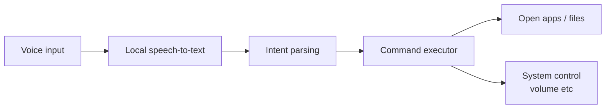

# Buddy Architecture

## Command flow

```mermaid
flowchart LR
    V[Voice input] --> STT[Local speech-to-text]
    STT --> NLU[Intent parsing]
    NLU --> EX[Command executor]
    EX --> APP[Open apps / files]
    EX --> SYS[System control<br/>volume etc]
```
